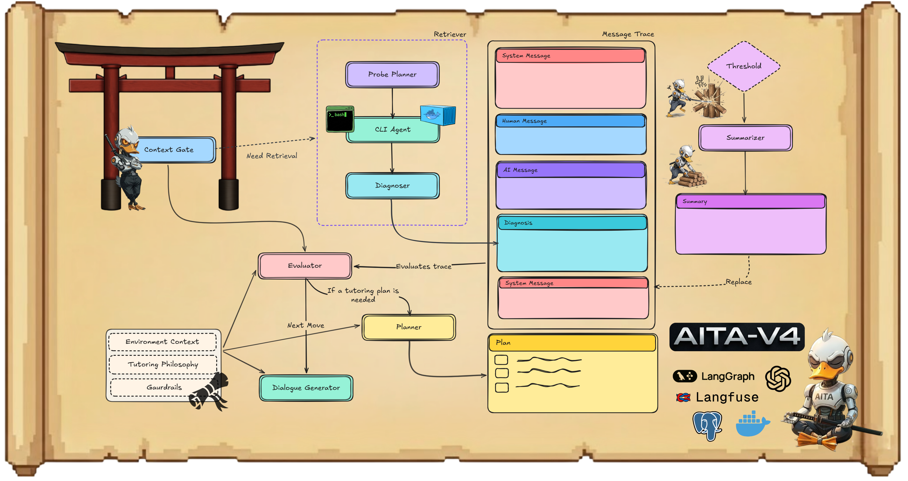

---
[](https://discord.gg/x4dMAgARKk)

An environment-aware, agentic teaching assistant built with LangGraph that inspects code and context to deliver grounded, course-aligned guidance for programming courses.


## How It Works

Aita is a cybernetic duck-samurai teaching assistant built for course level assistance, designed to give immediate, context-aware help while preserving the critical thinking and problem-solving expected from students. It uses Socratic, question-driven tutoring and an internal plan of subgoals to break problems down and guide learners step-by-step toward their own solutions.

Version 4 uses the GPT-5.1 family of models, including reasoning models for structured decision-making and chat models for dialogue generation. The system leverages LangGraph for agent orchestration and PostgreSQL for persistent state management.

Each chat session is governed by a student-specific Docker container that serves as the main source of retrieval in the system. This approach represents agentic RAG, where the agent decides what and how much information is needed to provide assistance. Unlike traditional RAG that queries static embeddings, Aita's retriever agents perform targeted, on-demand exploration of the live student environment through sandboxed CLI execution, enabling grounded, context-aware responses based on the actual state of the student's code.

### Tutoring Approach

Aita uses Socratic questioning and scaffolded guidance to help students discover solutions themselves. It never provides direct code examples or complete solutions for course projects, instead guiding through concepts, hints, and thought processes. The system maintains a short-term plan of 3-5 actionable subgoals that track the agent's internal roadmap for resolving the issue. As the conversation evolves or student needs shift, Aita dynamically replans, replacing the entire plan when necessary to stay aligned with the current objective. The system adapts its approach based on student progress, escalating help gradually when needed while preserving student autonomy. The goal isn't just to solve the immediate problem, but to build understanding that transfers to future challenges.

### Context Management

Aita uses LangGraph's `MessagesState` to maintain a single unified message trace that contains the entire conversation history. This trace includes student messages, tutor responses, and internal system messages from agents like `[Diagnoser]`, `[Planner]`, and `[Evaluator]`. All nodes access this same trace, ensuring each agent sees the full context of what has been discovered, planned, and decided throughout the conversation. This unified approach is essential for coordinated decision-making, as the Context Gate can check if retrieval already occurred, the Evaluator can see diagnostic findings, and the Dialogue Generator can reference prior reasoning without losing context.

As conversations grow, the message trace accumulates all interactions. When it exceeds a configurable threshold (default 15 messages), the Message Summarizer condenses the entire trace into a comprehensive summary that preserves critical information like project details, code structure, bugs found, and student progress. The original messages are removed and replaced with this summary, keeping the context window manageable while maintaining the essential context needed for effective tutoring. It's compression with understanding, not just truncation.

## Agent System



The system consists of specialized nodes that work together:

- **Context Gate**: First thing that runs. Looks at the conversation and asks: do we need to go inspect the student's code, or do we already know enough? If there's a `[Diagnoser]` entry that covers what the student is asking about, skip the expensive retrieval. Otherwise, route to the Retriever. Simple optimization that saves a lot of compute.

- **Retriever**: A subgraph that actually goes into the student's Docker container and explores. Three nodes work together here:
  - **Probe Planner**: Figures out what to look for. Reads the conversation, sees what's missing, and generates a focused exploration task.
  - **CLI Agent**: Runs safe, read-only bash commands (ls, cat, grep, etc.) inside the container. Can't modify anything, just inspects. All the CLI tool calls and outputs get stored in a separate `cli_trace` field, not in the main message trace.
  - **Diagnoser**: Takes all the CLI output from `cli_trace` and turns it into a clean diagnosis. Filters out internal paths and Docker details, gives you just the insights about the student's code and issue. The diagnosis gets added to the main message trace as `[Diagnoser]`, then `cli_trace` gets cleared. This separation keeps the messy CLI exploration separate from the clean conversation context.

- **Evaluator**: The brain that decides what happens next. Reads the full conversation, checks if the student is stuck or making progress, then outputs control signals: should we create a plan? Should we escalate to a human TA? Should we even respond this turn? Also tracks which subgoals are done and marks them complete. Uses reasoning models to think through all this.

- **Planner**: When the Evaluator says we need a plan, this node creates one. Takes the conversation history and the current issue, breaks it down into 3-5 subgoals that represent the agent's internal roadmap for helping the student. The plan isn't shown to the student, it's just for coordinating the agents. If the conversation shifts, the Planner replaces the whole plan with a new one.

- **Dialogue Generator**: This is where Aita actually talks to the student. While the other nodes use reasoning models for structured decision-making, the Dialogue Generator uses `gpt-5.1-chat-latest` to produce natural, engaging responses. It takes all the internal reasoning from the Evaluator, the plan from the Planner, and the diagnostic context from the Retriever, then turns it into a conversation that feels human, calm, direct, and helpful without giving away the answer.

- **Message Summarizer**: The message trace keeps growing, every student message, every agent decision, every diagnosis gets added. Eventually you hit the context limit. So when the trace exceeds a threshold (default 15 messages), this node compresses everything into a summary. It's not just trimming, it's actually understanding what matters and preserving the essential context while throwing away the noise. The old messages get removed, the summary takes their place, and the conversation continues without losing critical information.

## Setup

Copy `.env.example` to `.env` and set:

```
OPENAI_API_KEY=
PGUSER=
PGPASSWORD=
PGHOST=
PGPORT=
PGDATABASE=
EXEC_PROJECTS_ROOT=     # Path to course projects
EXEC_SNAPSHOT_ROOT=     # Path to student code snapshots
EXEC_IMAGE=             # Sandbox Docker image (default: aita-sandbox:latest)
```

Example Sandbox Docker image provided at `src/aita/sandbox_img/`:

```bash
cd src/aita/sandbox_img/
docker build -t aita-sandbox:latest .
```

### Workspace Setup

Set up the course projects workspace at the path specified in `EXEC_PROJECTS_ROOT`. Organize your projects within the workspace as needed. Example structure:

```
EXEC_PROJECTS_ROOT/
├── project-name/
│   ├── level-01/
│   │   ├── instructions.md
│   │   ├── templates/
│   │   ├── model/          # Model solutions
│   │   └── system_tests/    # Test files
│   └── level-02/
│       └── ...
```

Project directories can include instructions, templates, model solutions, and test cases as needed.

Student code snapshots are mounted from `EXEC_SNAPSHOT_ROOT` to provide live access to student work. The mounting logic in `src/aita/utils.py` automatically maps student snapshots to `/workspace/projects/{project}/{level}/student_code_snapshot` within the Docker container, enabling Aita to inspect the actual state of student code in real-time.

### Course-Level Adoption

To deploy Aita for a new course, update the following:

- **Prompts**: Modify system prompts in `src/aita/prompts/catalog/` to align with course-specific tutoring philosophy and guardrails
- **Environment Context**: Update `student_environment_context.md` and `sandbox_environment_context.md` with course-specific project structures and conventions
- **Docker Image**: Customize the sandbox image (`src/aita/sandbox_img/Dockerfile`) if the course requires specific tools or dependencies
- **Project Paths**: Configure `EXEC_PROJECTS_ROOT` and `EXEC_SNAPSHOT_ROOT` to point to course-specific directories

## Usage

### Development

```bash
pip install -e .
langgraph dev
```

### Production

```bash
chmod +x redeploy-aita-v4.sh
./redeploy-aita-v4.sh
```

### API

The API is built with [FastAPI](https://fastapi.tiangolo.com/).

POST `/chat`

```json
{
  "session_id": "unique-session-id",
  "course_code": "CSE240",
  "project_id": "proj-1",
  "user_id": "student-123",
  "messages": [
    {"role": "user", "content": "My code segfaults when I run it"}
  ]
}
```

## References

- [1] **LangGraph** (LangChain, 2023) – A framework by LangChain for building controllable, graph-based multi-agent orchestration in LLM applications. [Official docs](https://langchain-ai.github.io/langgraph/)
- [2] **mini-swe-agent** (Princeton & Stanford, 2024) – The open-source 100-line coding agent (with only a Bash tool) that inspired our Docker-based agentic RAG design. [GitHub Repository](https://github.com/SWE-agent/mini-swe-agent)
- [3] **LangGraph Plan-and-Execute** (LangChain) – A tutorial on implementing plan-and-execute patterns in LangGraph for breaking down complex tasks into manageable subgoals. [Tutorial](https://langchain-ai.github.io/langgraph/tutorials/plan-and-execute/plan-and-execute/)
- [4] **Plan-and-Act: Improving Planning of Agents for Long-Horizon Tasks** (Erdogan et al., ICML 2025) – Proposed improvements to planning-executor agent architectures for handling long-horizon tasks. [Paper](https://openreview.net/forum?id=ybA4EcMmUZ)
- [5] **Context Engineering 2.0: The Context of Context Engineering** (Hua et al., 2025) – A perspective and framework for "context engineering" across agent eras, exploring how context is managed and optimized in modern agent systems. [Paper](https://arxiv.org/abs/2510.26493)
- [6] **AutoTutor** (Graesser et al., 2001/2005) – An early intelligent tutoring system that engages students through mixed-initiative natural language dialogue, asking open-ended questions and providing feedback in a conversational manner. It pioneered many tactics (e.g. Socratic questioning, scaffolding) used in modern tutoring agents. [Overview](https://en.wikipedia.org/wiki/AutoTutor)
- [7] **LLM Agents for Education: Advances and Applications** (Chu et al., 2025) – A comprehensive survey of how large language model agents are being applied in education. Covers pedagogical agents for feedback, hint generation, curriculum design, as well as domain-specific tutor agents, and discusses challenges like hallucinations and student overreliance. [Paper](https://arxiv.org/abs/2501.00000)
- [8] **ReAct: Synergizing Reasoning and Acting in LLMs** (Yao et al., 2023) – Introduced an agent prompting framework that interleaves chain-of-thought reasoning with task-specific actions, enabling LLMs to reason and use tools in tandem. [Paper](https://arxiv.org/abs/2210.03629)
- [9] **Chain-of-Thought Prompting** (Wei et al., 2022) – Demonstrated that prompting large models to produce step-by-step reasoning ("chains of thought") can significantly improve their problem-solving abilities. [Paper](https://arxiv.org/abs/2201.11903)
- [10] **Toolformer** (Schick et al., 2023) – Showed that LLMs can self-learn to call external tools (e.g. search, calculators, APIs) by inserting tool-use tokens during training, improving accuracy on tasks without sacrificing language modeling. [Paper](https://arxiv.org/abs/2302.04761)
- [11] **Reflexion** (Shinn et al., 2023) – Introduced a self-reflective agent loop: after each trial, the agent stores dynamic memory and critiques its own mistakes, then retries with adjusted reasoning. This approach allows an LLM agent to learn from failures and avoid repeating errors in decision-making. [Paper](https://arxiv.org/abs/2303.11366)
- [12] **Generative Agents** (Park et al., 2023) – Showcased believable simulated characters driven by an LLM with long-term memory and reflection. Each agent in the sandbox environment (inspired by The Sims) records experiences, synthesizes memories, and dynamically retrieves them to plan behavior. [Paper](https://arxiv.org/abs/2304.03442)
- [13] **HuggingGPT** (Shen et al., 2023) – An LLM-based agent (using ChatGPT) that plans a task into subtasks and delegates them to specialized models from Hugging Face, then aggregates the results. It was an early example of using an LLM as a controller to coordinate multiple AI models. [Paper](https://arxiv.org/abs/2303.17580)
- [14] **Voyager** (Wang et al., 2023) – The first lifelong learning LLM embodied in Minecraft. Voyager uses GPT-4 to write and refine code that lets the agent act in the world, logging successes as skills. It features an automatic curriculum and self-verification loop to iteratively improve at open-ended tasks. [Paper](https://arxiv.org/abs/2305.16291)
- [15] **Auto-GPT** (Richards et al., 2023) – A popular open-source project that chains GPT-4 calls to create an autonomous agent: it generates goals, plans actions, executes code (e.g. via Python), and iterates until the goals are completed. [GitHub](https://github.com/Significant-Gravitas/AutoGPT)
- [16] **BabyAGI** (Nakajima, 2023) – A minimalist task-driven agent that maintains a task list and uses an LLM to continually pick up new tasks, prioritize them, and execute them. It inspired many subsequent "autonomous AI" frameworks. [GitHub](https://github.com/yoheinakajima/babyagi)
- [17] **deepagents** (LangChain) – Agent harness with planning tools, filesystem backend, and sub-agent delegation. [GitHub](https://github.com/langchain-ai/deepagents)
- [18] **Open SWE** (LangChain) – Open-source asynchronous coding agent built with LangGraph; plan → execute across repos, PRs, etc. [GitHub](https://github.com/langchain-ai/open-swe)
- [19] **Open Deep Research** (LangChain) – Open-source deep research agent (configurable across models/search/MCP). [GitHub](https://github.com/langchain-ai/open_deep_research)
- [20] **Andrej Karpathy — "We're summoning ghosts, not building animals"** (Dwarkesh Podcast) – Signal-rich discussion about the current limits of agents and what "real" autonomy might require. [Video](https://www.youtube.com/watch?v=lXUZvyajciY)