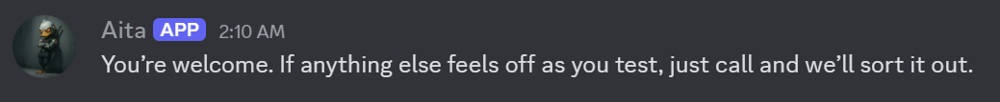
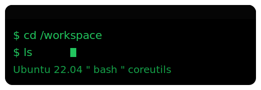
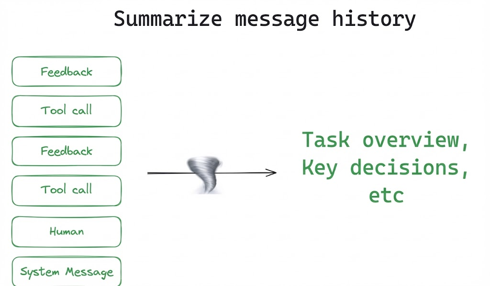

<p align="center">
  
</p>

<p align="center">
  <a href="https://discord.gg/x4dMAgARKk">
    
  </a>
</p>

<p align="center">
  
  
  
  
  
  
</p>

<p align="center">
  <b>An agentic teaching assistant for programming projects that inspects your code when needed and gives course-aligned, context-aware, Socratic tutoring while preserving the critical thinking students are expected to do.</b>
</p>

<p align="center">
  
</p>

<p align="center">
  
  
  
  
</p>

## How It Works

Aita is a cybernetic duck-samurai teaching assistant for programming courses. You ask a question, and it provides immediate, context-aware tutoring while preserving the critical thinking and problem-solving expected from students.

**High-level flow**
1. **You ask a question** (e.g., an error, failing test, confusing concept).
2. **Aita decides what context it needs** (which files, logs, or checks matter).
3. **It inspects the project in a sandbox** (student-specific Docker container; targeted file reads and limited CLI actions).
4. **It evaluates and may respond** (forms a short 3–5 subgoal plan, then either tutors Socratically with hints and next steps, or suppresses the response if not needed, or escalates to a human TA).

Under the hood, Version 4 uses the GPT-5.1 family of models (reasoning models for decision-making + chat models for response generation), with [LangGraph](https://langchain-ai.github.io/langgraph/) [1] for orchestration and PostgreSQL for persistent state.

<p align="left">
  <a href="https://langchain-ai.github.io/langgraph/">
    
  </a>
</p>

**Observability:** [Langfuse](https://langfuse.com) is integrated for tracing only, providing visibility into agent execution flows and LLM calls for debugging and monitoring.

<p align="left">
  <a href="https://langfuse.com">
    
  </a>
</p>

### Tutoring Approach

Aita uses Socratic questioning and scaffolded guidance to help students discover solutions themselves [6]. It avoids providing complete solutions for course projects; instead it guides through concepts, debugging strategy, and incremental next actions. As the conversation evolves, Aita updates its 3–5 subgoal plan [3, 4] to stay aligned with the current objective, escalating help gradually while preserving student autonomy. (See [`src/aita/prompts/catalog/guidelines/`](src/aita/prompts/catalog/guidelines/) for the full philosophy and guardrails.)

<p align="center">

  
</p>

### Architecture Notes

**Agentic retrieval (agentic RAG):** each chat session runs against a student-specific Docker environment that acts as the primary "source of truth" for both project context and code inspection. Instead of relying only on static embeddings, retriever agents can perform targeted, on-demand exploration of the live project via sandboxed CLI execution (e.g., checking file structure, reading relevant code, running a limited check) so responses stay grounded in the actual state of the code [2].

<p align="left">
  
</p>

**State + summarization (context management):** Aita uses LangGraph’s `MessagesState` as a unified message trace that includes user messages, tutor responses, and internal agent messages (e.g., `[Diagnoser]`, `[Planner]`, `[Evaluator]`). When the trace exceeds a configurable threshold (default 15 messages), a summarizer replaces older messages with a durable summary that preserves essentials (project context, code structure, key findings, progress) to keep the context window manageable [5].

<p align="left">
  <a href="https://blog.langchain.com/context-engineering-for-agents/">
    
  </a>
</p>

## Agent System


The system consists of specialized nodes that work together:

- **Context Gate**: First thing that runs. Looks at the conversation and asks: do we need to go inspect the student's code, or do we already know enough? If there's a `[Diagnoser]` entry that covers what the student is asking about, skip the expensive retrieval. Otherwise, route to the Retriever. Simple optimization that saves a lot of compute.

- **Retriever**: A subgraph that actually goes into the student's Docker container and explores. Three nodes work together here:
  - **Probe Planner**: Figures out what to look for. Reads the conversation, sees what's missing, and generates a focused exploration task.
  - **CLI Agent**: Runs safe, read-only bash commands (ls, cat, grep, etc.) inside the container. Can't modify anything, just inspects. All the CLI tool calls and outputs get stored in a separate `cli_trace` field, not in the main message trace. The agent uses a bash execution tool [2, 10] to interact with the environment.
  - **Diagnoser**: Takes all the CLI output from `cli_trace` and turns it into a clean diagnosis. Filters out internal paths and Docker details, gives you just the insights about the student's code and issue. The diagnosis gets added to the main message trace as `[Diagnoser]`, then `cli_trace` gets cleared. This separation keeps the messy CLI exploration separate from the clean conversation context.

- **Evaluator**: The brain that decides what happens next. Reads the full conversation, checks if the student is stuck or making progress, then outputs control signals: should we create a plan? Should we escalate to a human TA? Should we even respond this turn? Also tracks which subgoals are done and marks them complete. Uses reasoning models [8, 9] to think through all this.

- **Planner**: When the Evaluator says we need a plan, this node creates one. Takes the conversation history and the current issue, breaks it down into 3-5 subgoals that represent the agent's internal roadmap for helping the student [3, 4]. The plan isn't shown to the student, it's just for coordinating the agents. If the conversation shifts, the Planner replaces the whole plan with a new one.

- **Dialogue Generator**: This is where Aita actually talks to the student. While the other nodes use reasoning models for structured decision-making, the Dialogue Generator uses `gpt-5.1-chat-latest` to produce natural, engaging responses. It takes all the internal reasoning from the Evaluator, the plan from the Planner, and the diagnostic context from the Retriever, then turns it into a conversation that feels human, calm, direct, and helpful without giving away the answer.

- **Message Summarizer**: The message trace keeps growing, every student message, every agent decision, every diagnosis gets added. Eventually you hit the context limit. So when the trace exceeds a threshold (default 15 messages), this node compresses everything into a summary. It's not just trimming, it's actually understanding what matters and preserving the essential context while throwing away the noise [5, 12]. The old messages get removed, the summary takes their place, and the conversation continues without losing critical information.

## Setup and Usage

<details>
<summary>Click to expand setup instructions</summary>

Copy `.env.example` to `.env` and set:

```
OPENAI_API_KEY=
PGUSER=
PGPASSWORD=
PGHOST=
PGPORT=
PGDATABASE=
EXEC_PROJECTS_ROOT=     # Path to course projects
EXEC_SNAPSHOT_ROOT=     # Path to student code snapshots
EXEC_IMAGE=             # Sandbox Docker image (default: aita-sandbox:latest)
```

Example Sandbox Docker image provided at `src/aita/sandbox_img/`:

```bash
cd src/aita/sandbox_img/
docker build -t aita-sandbox:latest .
```

### Workspace Setup

Set up the course projects workspace at the path specified in `EXEC_PROJECTS_ROOT`. Organize your projects within the workspace as needed. Example structure:

```
EXEC_PROJECTS_ROOT/
├── project-name/
│   ├── level-01/
│   │   ├── instructions.md
│   │   ├── templates/
│   │   ├── model/          # Model solutions
│   │   └── system_tests/    # Test files
│   └── level-02/
│       └── ...
```

Project directories can include instructions, templates, model solutions, and test cases as needed.

Student code snapshots are mounted from `EXEC_SNAPSHOT_ROOT` to provide live access to student work. The mounting logic in `src/aita/utils.py` automatically maps student snapshots to `/workspace/projects/{project}/{level}/student_code_snapshot` within the Docker container, enabling Aita to inspect the actual state of student code in real-time.

### Course-Level Adoption

To deploy Aita for a new course, update the following:

- **Prompts**: Modify system prompts in [`src/aita/prompts/catalog/sys_prompts/`](src/aita/prompts/catalog/sys_prompts/) and guidelines in [`src/aita/prompts/catalog/guidelines/`](src/aita/prompts/catalog/guidelines/) to align with course-specific tutoring philosophy and guardrails
- **Environment Context**: Update [`student_environment_context.md`](src/aita/prompts/catalog/contexts/student_environment_context.md) and [`sandbox_environment_context.md`](src/aita/prompts/catalog/contexts/sandbox_environment_context.md) with course-specific project structures and conventions
- **Docker Image**: Customize the sandbox image (`src/aita/sandbox_img/Dockerfile`) if the course requires specific tools or dependencies
- **Project Paths**: Configure `EXEC_PROJECTS_ROOT` and `EXEC_SNAPSHOT_ROOT` to point to course-specific directories
- **Docker Compose**: Edit `docker-compose.yml` to update course-specific volume mounts. The current configuration includes CSE 240-specific paths:
  ```yaml
  volumes:
    - /opt/aita/cse240/aita-sandbox:/opt/aita/cse240/aita-sandbox
    - /opt/data/cse240:/opt/data/cse240
  ```
  Replace `cse240` with your course identifier and update the host paths to match your course's directory structure.

</details>
How to run:
<details>
<summary>Click to expand usage instructions</summary>

### Development

```bash
pip install -e .
langgraph dev
```

### Production

```bash
chmod +x redeploy-aita-v4.sh
./redeploy-aita-v4.sh
```

### API

The API is built with [FastAPI](https://fastapi.tiangolo.com/).

POST `/chat`

```json
{
  "session_id": "unique-session-id",
  "course_code": "CSE240",
  "project_id": "proj-1",
  "user_id": "student-123",
  "messages": [
    {"role": "user", "content": "My code segfaults when I run it"}
  ]
}
```

</details>

## Interface

Aita is currently deployed for **CSE 240: Introduction to Programming Languages** at Arizona State University. The course covers programming projects in C, C++, Scheme, and Prolog on the [pwn.college dojo platform](https://pwn.college/intro-to-programming-languages/). Course details are available at [cse240.com/syllabus](https://cse240.com/syllabus).

The primary interface is a Discord bot integrated into the class Discord server. Students create threads for their questions, and each thread is treated as a separate session. Aita is capable of handling group discussions and maintains temporal flow when messages are embedded with usernames and timestamps in the API invocation, allowing the system to track multiple participants and conversation chronology within a single thread.

## References

- [1] **LangGraph** (LangChain, 2023) – A framework by LangChain for building controllable, graph-based multi-agent orchestration in LLM applications. [Official docs](https://langchain-ai.github.io/langgraph/)
- [2] **mini-swe-agent** (Princeton & Stanford, 2024) – The open-source 100-line coding agent (with only a Bash tool) that inspired our Docker-based agentic RAG design. [GitHub Repository](https://github.com/SWE-agent/mini-swe-agent)
- [3] **LangGraph Plan-and-Execute** (LangChain) – A tutorial on implementing plan-and-execute patterns in LangGraph for breaking down complex tasks into manageable subgoals. [Tutorial](https://langchain-ai.github.io/langgraph/tutorials/plan-and-execute/plan-and-execute/)
- [4] **Plan-and-Act: Improving Planning of Agents for Long-Horizon Tasks** (Erdogan et al., ICML 2025) – Proposed improvements to planning-executor agent architectures for handling long-horizon tasks. [Paper](https://openreview.net/forum?id=ybA4EcMmUZ)
- [5] **Context Engineering 2.0: The Context of Context Engineering** (Hua et al., 2025) – A perspective and framework for "context engineering" across agent eras, exploring how context is managed and optimized in modern agent systems. [Paper](https://arxiv.org/abs/2510.26493)
- [6] **AutoTutor** (Graesser et al., 2001/2005) – An early intelligent tutoring system that engages students through mixed-initiative natural language dialogue, asking open-ended questions and providing feedback in a conversational manner. It pioneered many tactics (e.g. Socratic questioning, scaffolding) used in modern tutoring agents. [Overview](https://en.wikipedia.org/wiki/AutoTutor)
- [7] **LLM Agents for Education: Advances and Applications** (Chu et al., 2025) – A comprehensive survey of how large language model agents are being applied in education. Covers pedagogical agents for feedback, hint generation, curriculum design, as well as domain-specific tutor agents, and discusses challenges like hallucinations and student overreliance. [Paper](https://arxiv.org/abs/2501.00000)
- [8] **ReAct: Synergizing Reasoning and Acting in LLMs** (Yao et al., 2023) – Introduced an agent prompting framework that interleaves chain-of-thought reasoning with task-specific actions, enabling LLMs to reason and use tools in tandem. [Paper](https://arxiv.org/abs/2210.03629)
- [9] **Chain-of-Thought Prompting** (Wei et al., 2022) – Demonstrated that prompting large models to produce step-by-step reasoning ("chains of thought") can significantly improve their problem-solving abilities. [Paper](https://arxiv.org/abs/2201.11903)
- [10] **Toolformer** (Schick et al., 2023) – Showed that LLMs can self-learn to call external tools (e.g. search, calculators, APIs) by inserting tool-use tokens during training, improving accuracy on tasks without sacrificing language modeling. [Paper](https://arxiv.org/abs/2302.04761)
- [11] **Reflexion** (Shinn et al., 2023) – Introduced a self-reflective agent loop: after each trial, the agent stores dynamic memory and critiques its own mistakes, then retries with adjusted reasoning. This approach allows an LLM agent to learn from failures and avoid repeating errors in decision-making. [Paper](https://arxiv.org/abs/2303.11366)
- [12] **Generative Agents** (Park et al., 2023) – Showcased believable simulated characters driven by an LLM with long-term memory and reflection. Each agent in the sandbox environment (inspired by The Sims) records experiences, synthesizes memories, and dynamically retrieves them to plan behavior. [Paper](https://arxiv.org/abs/2304.03442)
- [13] **HuggingGPT** (Shen et al., 2023) – An LLM-based agent (using ChatGPT) that plans a task into subtasks and delegates them to specialized models from Hugging Face, then aggregates the results. It was an early example of using an LLM as a controller to coordinate multiple AI models. [Paper](https://arxiv.org/abs/2303.17580)
- [14] **Voyager** (Wang et al., 2023) – The first lifelong learning LLM embodied in Minecraft. Voyager uses GPT-4 to write and refine code that lets the agent act in the world, logging successes as skills. It features an automatic curriculum and self-verification loop to iteratively improve at open-ended tasks. [Paper](https://arxiv.org/abs/2305.16291)
- [15] **Auto-GPT** (Richards et al., 2023) – A popular open-source project that chains GPT-4 calls to create an autonomous agent: it generates goals, plans actions, executes code (e.g. via Python), and iterates until the goals are completed. [GitHub](https://github.com/Significant-Gravitas/AutoGPT)
- [16] **BabyAGI** (Nakajima, 2023) – A minimalist task-driven agent that maintains a task list and uses an LLM to continually pick up new tasks, prioritize them, and execute them. It inspired many subsequent "autonomous AI" frameworks. [GitHub](https://github.com/yoheinakajima/babyagi)
- [17] **deepagents** (LangChain) – Agent harness with planning tools, filesystem backend, and sub-agent delegation. [GitHub](https://github.com/langchain-ai/deepagents)
- [18] **Open SWE** (LangChain) – Open-source asynchronous coding agent built with LangGraph; plan → execute across repos, PRs, etc. [GitHub](https://github.com/langchain-ai/open-swe)
- [19] **Open Deep Research** (LangChain) – Open-source deep research agent (configurable across models/search/MCP). [GitHub](https://github.com/langchain-ai/open_deep_research)
- [20] **Andrej Karpathy — "We're summoning ghosts, not building animals"** (Dwarkesh Podcast) – Signal-rich discussion about the current limits of agents and what "real" autonomy might require. [Video](https://www.youtube.com/watch?v=lXUZvyajciY)